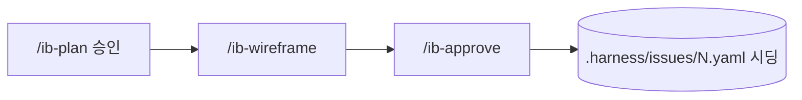
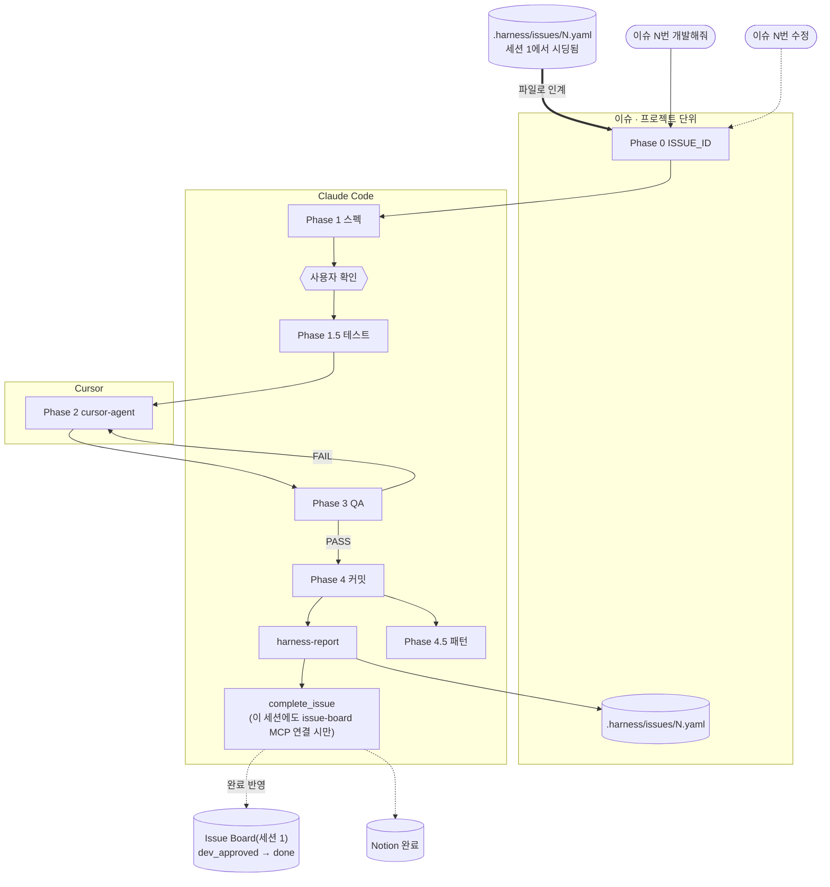

# harness_build

모든 스택 프로젝트를 위한 **Claude Code** 하네스.  
자연어 한 줄로 **기획 → 테스트 → 구현 → QA → 커밋 → (선택) 패턴**까지 실행한다.

지원 스택: **Next.js · React · Vue · Nuxt · Express · NestJS · FastAPI · Django · Flask · Go · Flutter · Android · iOS · fallback**

> **AX 팀 패턴:** `저장해줘` → `local/` · `팀에 올려줘` → `team-patterns/` PR · `install.sh --sync-patterns`

**현재 버전:** `v0.9.0` (`harness_global/VERSION`)

---

## Quick Start

```bash
git clone https://github.com/LEEHEEWON123/harness_build.git
bash install.sh /path/to/your-project
bash install.sh --sync-patterns /path/to/your-project   # 팀 패턴 갱신
```

프로젝트에서: `로그인 API 만들어줘` · `이슈 1번 수정해줘`

---

## 일상 사용

| 말하면 | 동작 |
|--------|------|
| 기능 만들어줘 / 버그 고쳐줘 | `dev` 파이프라인 (신규 이슈 ID 부여) |
| **이슈 N번 수정** | 같은 기능 이슈에 amendment run 추가 |
| 스펙/테스트/구현/QA 다시 | 해당 Phase 재실행 |
| 커밋해줘 → `저장해줘` | 커밋 → `harness-report` → 패턴 저장 |
| `팀에 올려줘` / `팀 패턴 sync` | 승격 PR / sync |

---

## 파이프라인 (dev)

**시각화:** [docs/dev-pipeline.md](docs/dev-pipeline.md)

**세션 1(Issue Board)과 세션 2(개발)는 서로 다른 Claude Code 실행**이다 — 보통 시점도 다르고(기획은 미리, 개발은 나중에), 개발 세션은 다른 사람이 다른 cwd에서 시작할 수도 있다. 둘을 잇는 유일한 통로는 ①`.harness/issues/N.yaml` 파일(세션 1 → 세션 2, 필수)과 ②`complete_issue` MCP 호출(세션 2 → 세션 1/Notion, 선택) 뿐이라 **세션 2 쪽에 issue-board MCP(`.mcp.json`)가 연결돼 있지 않으면 완료 훅만 조용히 스킵되고 개발 자체는 그대로 끝난다.**

### 1) 이슈보드 세션 (기획자) — 대시보드에서 기획 → 승인



### 2) 개발 세션 — 이슈 기반 개발 (별도 실행)



| Phase | 산출물 |
|-------|--------|
| 0 | `ISSUE_ID`, `_workspace/..._issue-N_...` |
| 1 | `01_spec.md` |
| 2 | `02_implementation.md` |
| 3 | `03_qa_report.md` |
| 4 | 커밋 → `harness-report.sh` → `.harness/issues/` → (연결 시) `complete_issue` → 이슈보드 `done` + Notion `완료` |

`.harness/issues/N.yaml`은 Issue Board(`/ib-approve`)가 먼저 시딩해두면 Phase 0이 `runs: []`를 최초 실행(`kind: initial`)으로 읽는다. issue-board 없이 `dev` 파이프라인만 써도(신규 기능 요청) 그대로 동작 — 이 경우 Phase 0이 새 `ISSUE_ID`를 발급하고, Phase 4의 완료 훅은 issue-board MCP가 안 보이면 조용히 스킵된다.

상세·Issue Board 연동: [docs/dev-pipeline.md](docs/dev-pipeline.md)

---

## 기능 이슈 추적

**이슈 = 기능 단위 (고정 ID)** · **run = 파이프라인 1회**

```
.harness/issues/1.yaml     ← 기능 #1 (제목, runs[], files[])
_workspace/..._issue-1_*/  ← 실행 이력 (initial / amendment)
```

| 항목 | 설명 |
|------|------|
| `issue_id` | `01_spec.md` frontmatter — Hub·report 기준 |
| `parent_run_id` | 수정 run이 어떤 run에서 이어지는지 |
| `harness-report.sh` | run·변경 파일 → `.harness/issues/{id}.yaml` sync |

```bash
bash .harness/scripts/harness-report.sh
```

Issue Board **이슈 탭**: `#1` 선택 → run 타임라인 + 누적 파일 + Phase 태스크

---

## 설치

| 명령 | 용도 |
|------|------|
| `bash install.sh /project` | 하네스 설치 |
| `bash install.sh --sync-patterns .` | 팀 패턴 sync |

산출물: `.claude/`, `harness.config.yaml`, `.harness/{patterns,issues,scripts}/`, `.cursor/rules/`

---

## harness.config.yaml

```yaml
stack: auto
phase2: cursor-agent   # cursor-agent | claude
```

전체: `harness_global/harness.config.yaml`

---

## Issue Board

`apps/issue-board`(대시보드, Next.js) + `apps/issue-board-mcp`(백엔드, Node/TS) 2개 앱으로 구성. 백엔드는 SQLite에 기획·이슈·디자인시스템·와이어프레임을 저장하고 REST(`/api/*`)와 MCP(`/mcp`)를 함께 제공한다.

```bash
# 최초 1회: 각 앱 의존성 설치
cd apps/issue-board-mcp && npm install && cd ../issue-board && npm install && cd ../..

# 루트에서 한 번에 실행 (concurrently)
npm install   # 최초 1회 — concurrently 설치
npm run start:all   # mcp :4000 (REST /api/*, MCP /mcp) + board :5173 (대시보드) + pattern :3100 (패턴 뷰어)

# 개별 실행이 필요하면
cd apps/issue-board-mcp && npm run dev   # :4000
cd apps/issue-board && npm run dev       # :5173
```

**현재 탭 (4개):** 기획 · 이슈 · 디자인시스템 · 와이어프레임 — 팀 패턴 탭은 아직 없음 (개발 시점 2차로 이연)

| 탭 | 데이터 |
|----|--------|
| 기획 | `plans` (+ `plan_snapshots`) |
| 이슈 | `issues` (`planned` → `wireframed` → `dev_approved` → `done`) |
| 디자인시스템 | `design_systems` (컬러 토큰·`@scope/ui` / Storybook 메타. 컴포넌트 카탈로그는 선택 항목) |
| 와이어프레임 | `wireframes` (이슈당 screens JSON, 최종 HTML 산출물) |

### 커맨드 흐름

```
/ib-plan          기획 작성·승인 (MVP 행 → 이슈 생성)
       ↓
/ib-wireframe     이슈 + 디자인시스템 기반 화면 와이어 적재
       ↓
대시보드 검토
       ↓
/ib-approve       개발 착수 게이트 → .harness/issues/{number}.yaml 시딩
       ↓
"이슈 N번 개발해줘"  → 기존 TDD 파이프라인
```

**기획 개정 연동:** 이미 승인된 기획을 수정한 뒤 `update_plan(..., approved)` 또는 MCP `sync_plan_issues` → 이슈 create/update, 변경분은 와이어 무효화(`planned`) → `/ib-wireframe` 재실행 → 필요 시 `/ib-approve` 재승인. (표에서 빠진 기능 행은 이슈를 삭제하지 않고 orphaned로만 보고)

디자인시스템은 [Turborepo design-system](https://github.com/vercel/turborepo/tree/main/examples/design-system)처럼 `packages/ui` + Storybook(`apps/docs`)을 소스 오브 트루스로 두고, 보드는 컬러 토큰 조회용이다. (개발용 목데이터 시드 스크립트는 제거됨 — REST API로 직접 기획/이슈/디자인시스템을 적재한다.) 컴포넌트 카탈로그는 프론트 재량으로 수시로 바뀔 수 있다고 보고 DS 등록 대상에서 뺐다 — `upsert_design_system`의 `components`는 선택 필드로만 남아 있다.

와이어프레임 탭은 이슈당 등록된 `screens[].html`을 iframe으로 그대로 렌더링한다 (`apps/issue-board/src/components/wireframe-preview/`). `/ib-wireframe`은 DS 컬러 토큰만 참고해 마크업을 새로 그리며, 컴포넌트 이름표는 달지 않는다.

`/ib-plan`은 기획 초반에 **플랫폼(웹/앱(모바일)/데스크톱/CLI)을 필수로 확인**하고 기획서 §1에 `**플랫폼:**` 줄로 고정 기록한다. `/ib-wireframe`은 이 값을 그대로 읽어 프레임(브라우저/폰/터미널)을 정하며, 별도로 추론하지 않는다.

스택: Next.js 15 · React 19 · Tailwind v4 · TS (대시보드) / Node 20 · TypeScript · better-sqlite3 · express · `@modelcontextprotocol/sdk` (백엔드)

### Notion 동기화 (선택)

이슈보드 → Notion **단방향** push. `apps/issue-board-mcp/.env`에 아래 두 값이 있을 때만 동작하고, 없으면 조용히 스킵한다 (하드 디펜던시 아님).

```bash
# apps/issue-board-mcp/.env
NOTION_API_KEY=ntn_...
NOTION_DATABASE_ID=<대상 데이터베이스 ID>
```

| 트리거 | 이슈보드 상태 | Notion `상태` |
|--------|--------------|---------------|
| 기획 승인/동기화 | `planned` | 기획 중 |
| `/ib-wireframe` | `wireframed` | 시작 전 |
| `/ib-approve` | `dev_approved` | 진행 중 |
| `/dev` 파이프라인 커밋 완료 (`complete_issue`) | `done` | 완료 |

- `우선순위`: `높음→높음`, `보통→중간`, `낮음→낮음` (Notion 쪽 옵션명이 "중간"이라 매핑 필요)
- 대시보드 이슈 목록에서 **Notion 상태를 직접 선택**할 수도 있다 (`보류`/`반영 대기` 등 이슈보드에 대응 상태가 없는 값 포함) — 수동으로 고른 값은 위 자동 매핑보다 항상 우선한다. 지우면(자동으로 되돌리면) 다시 파이프라인 상태 기준으로 동기화된다.
- 페이지 생성은 최초 1회(POST)뿐이고 이후엔 같은 페이지를 갱신(PATCH)한다 (`issues.notion_page_id`로 추적).
- Notion → 이슈보드 **역방향 동기화는 아직 없음** (Notion 쪽 API 웹훅으로 가능하지만 별도 작업).

---

## 레포 구조

```
harness_build/
├── install.sh
├── scripts/          harness-report, run-phase2-cursor, sync-team-patterns
├── team-patterns/
├── apps/issue-board/       대시보드 (Next.js, :5173)
├── apps/issue-board-mcp/   백엔드 (Node/TS, :4000, REST + MCP)
└── harness_global/
```

---

## 변경 이력

| 버전 | 주요 변경 |
|------|----------|
| v0.6.0 | cursor-agent Phase 2, Harness Hub (폐기, issue-board로 대체) |
| v0.6.1 | 기능 이슈 추적 (`.harness/issues/`, 이슈 탭) |
| v0.7.0 | Issue Board 신설 (기획/이슈/와이어프레임, SQLite+REST+MCP), `/ib-plan`·`/ib-approve` 커맨드, Harness Hub 대체 |
| v0.8.0 | 디자인시스템 탭·`design_systems` 테이블, `/ib-wireframe`, 기획 개정 시 `sync_plan_issues` (이슈/와이어 연동) |
| v0.9.0 | Notion 단방향 동기화(우선순위·상태 매핑, 수동 오버라이드), 이슈 `done` 상태 + `/dev` 완료 훅, `/ib-plan` 플랫폼(웹/앱/데스크톱/CLI) 필수 확인 |
