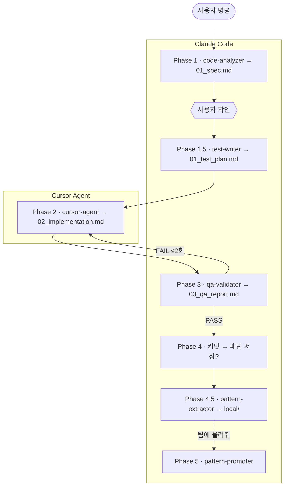

# harness_build

모든 스택 프로젝트를 위한 **Claude Code** 하네스.  
자연어 한 줄로 **기획 확인 → 테스트 선행 → 구현 → QA → 커밋 → (선택) 패턴 저장**까지 실행한다.

지원 스택: **Next.js · React · Vue · Nuxt · Express · NestJS · FastAPI · Django · Flask · Go · Flutter · Android · iOS · fallback**

> **AX 팀 패턴:** 커밋 후 `저장해줘` → `local/`. 팀 공유는 `팀에 올려줘` → `team-patterns/` PR → `install.sh --sync-patterns`.

**현재 버전:** `v0.6.0` (`harness_global/VERSION`)

---

## Quick Start

```bash
git clone https://github.com/LEEHEEWON123/harness_build.git
cd harness_build

bash install.sh /path/to/your-project

# 승격 PR 머지 후 — 팀 패턴만 갱신
bash install.sh --sync-patterns /path/to/your-project
```

프로젝트에서 Claude Code: `로그인 API 만들어줘`

---

## 일상 사용

| 말하면 | 동작 |
|--------|------|
| 기능 만들어줘 / 버그 고쳐줘 | `dev` 파이프라인 |
| 스펙 다시 / 테스트 다시 / 구현 수정 / QA 다시 | 해당 Phase 재실행 |
| 커밋해줘 → `저장해줘` | 커밋 후 `local/` 패턴 저장 |
| `팀에 올려줘` | `team-patterns/` draft PR |
| `팀 패턴 sync 해줘` | `--sync-patterns` |
| `여기서 구현` / `Claude로 구현` | Phase 2를 Claude implementer로 (일회성) |
| 리뷰해줘 | `code-review` 스킬 |

---

## 파이프라인 (dev)

**시각화:** [docs/dev-pipeline.md](docs/dev-pipeline.md) (Mermaid flowchart + sequence)

<details>
<summary>Mermaid 미리보기</summary>



</details>

| Phase | 에이전트 | 도구 | 산출물 |
|-------|----------|------|--------|
| 1 | code-analyzer | Claude | `01_spec.md` |
| 1.5 | test-writer | Claude | `01_test_plan.md` |
| 2 | cursor-agent | **Cursor** | `02_implementation.md` |
| 3 | qa-validator | Claude | `03_qa_report.md` |
| 4 | — | Claude | 커밋 |
| 4.5 | pattern-extractor | Claude | `local/` |
| 5 | pattern-promoter | Claude | team-patterns PR (별도) |

**Phase 2:** `HANDOFF.md` → `run-phase2-cursor.sh` → Phase 3 (같은 세션) · 대안 `phase2: claude` · 필요 `cursor-agent login`

**패턴 우선순위:** `local/` > `team/` > 스택 컨벤션

### `_workspace/` 산출물

| 파일 | Phase |
|------|-------|
| `01_spec.md` | 1 — 스펙·기획 |
| `01_test_plan.md` | 1.5 |
| `HANDOFF.md` | 2 |
| `02_implementation.md` | 2 — 구현·화면 추적 |
| `03_qa_report.md` | 3 |

---

## AX 팀 패턴

```
team-patterns/ (중앙 Git) ──sync──▶ .harness/patterns/team/  (커밋 X)
저장해줘 ──▶ .harness/patterns/local/                        (커밋 O)
```

상세: [team-patterns/README.md](team-patterns/README.md)

---

## 설치

| 명령 | 용도 |
|------|------|
| `bash install.sh /project` | 프로젝트 설치 |
| `bash install.sh --global` | `~/.claude` 스킬·에이전트 |
| `bash install.sh --sync-patterns .` | 팀 패턴만 갱신 |

설치 산출물: `.claude/`, `CLAUDE.md`, `harness.config.yaml`, `.harness/patterns/`, `.cursor/rules/`, `.harness/scripts/`

---

## harness.config.yaml

```yaml
stack: auto
phase2: cursor-agent   # cursor-agent | claude
patterns:
  team_dir: .harness/patterns/team
  local_dir: .harness/patterns/local
```

전체 스키마: `harness_global/harness.config.yaml`

---

## 앱 (프론트)

**스택:** Next.js 15 (App Router) · React 19 · Tailwind CSS v4 · TypeScript · `js-yaml`  
**데이터:** 서버 컴포넌트 + Node `fs`로 로컬 프로젝트 파일 읽기 (DB 없음)

### Harness Hub — 프로젝트 대시보드

```bash
cd apps/harness-hub
cp .env.local.example .env.local
npm install && npm run dev   # http://localhost:3001
```

`.env.local`:

```bash
HARNESS_PROJECTS=/path/a,/path/b    # 프로젝트 경로 (콤마 구분)
# 또는
PROJECTS_ROOT=/path/to/projects   # 하위 폴더 중 harness.config.yaml 있는 것 스캔
```

#### 화면 구성

```
/  (1차 — 프로젝트 선택)
│   프로젝트명 · 스택 · 하네스 버전 · 이슈/패턴/기획/화면 수
│
└─ /projects/[id]/  (2차 — 탭 4개)
    ├─ issues     이슈 (Phase 태스크)
    ├─ patterns   패턴
    ├─ specs      기획
    └─ screens    화면
```

| 화면 | 경로 | 보여주는 것 | 데이터 소스 |
|------|------|-------------|-------------|
| **프로젝트 목록** | `/` | 등록된 하네스 프로젝트 카드 | `HARNESS_PROJECTS` / `PROJECTS_ROOT` 스캔 |
| **이슈** | `/projects/[id]/issues` | run별 Phase 태스크 진행 | `_workspace/*/` 산출물 |
| **패턴** | `/projects/[id]/patterns` | team + local 패턴, 카테고리·검색 | `.harness/patterns/{team,local}/*.yaml` |
| **기획** | `/projects/[id]/specs` | PRD + 기능 스펙 목록·본문 | `.harness/docs/prd.md`, `_workspace/*/01_spec.md` |
| **화면** | `/projects/[id]/screens` | 구현된 페이지·컴포넌트 카드 | `_workspace/*/02_implementation.md` 파싱 |

```
┌─────────────────────────────────────────┐
│ Harness Hub                             │
├─────────────────────────────────────────┤
│ ▶ user-service    next  v0.6.0          │
│   이슈 5 · 패턴 24 · 기획 8 · 화면 12      │
└─────────────────────────────────────────┘
          │ 클릭
          ▼
┌─────────────────────────────────────────┐
│ user-service                            │
│ [ 이슈 ] [ 패턴 ] [ 기획 ] [ 화면 ]        │
├─────────────────────────────────────────┤
│ (선택 탭 콘텐츠)                         │
└─────────────────────────────────────────┘
```

**소스 구조:** `apps/harness-hub/src/app/` (라우트) · `components/` (탭·패널) · `lib/` (projects, patterns, specs, screens)

### Pattern Viewer — 단일 프로젝트 패턴

```bash
cd apps/pattern-viewer
cp .env.local.example .env.local   # PATTERNS_DIR
npm install && npm run dev         # http://localhost:3000
```

한 프로젝트 `.harness/patterns/`만 전체 화면으로 조회. Hub의 **패턴 탭**과 동일 데이터, 단일 프로젝트용.

---

## 레포 구조

```
harness_build/
├── install.sh
├── scripts/                    sync-team-patterns, promote-pattern, run-phase2-cursor
├── team-patterns/
├── apps/
│   ├── harness-hub/
│   └── pattern-viewer/
└── harness_global/
    ├── .claude/skills/         dev, code-review
    ├── .claude/agents/
    ├── cursor/                 team-patterns.mdc, phase2-implement.mdc
    └── stacks/{stack}/
```

---

## Cursor IDE

`install.sh` 시 `.cursor/rules/` 복사. `team-patterns.mdc`는 `alwaysApply`.  
풀 파이프라인은 Claude `dev` 스킬; Phase 2는 `cursor-agent` CLI.

---

## 변경 이력

| 버전 | 주요 변경 |
|------|----------|
| v0.5.x | team/local 패턴, Cursor rules, 승격 Phase 5 |
| v0.6.0 | Phase 2 `cursor-agent` 자동, Harness Hub (패턴·기획·화면 탭) |

이전 버전은 git history 참조.
