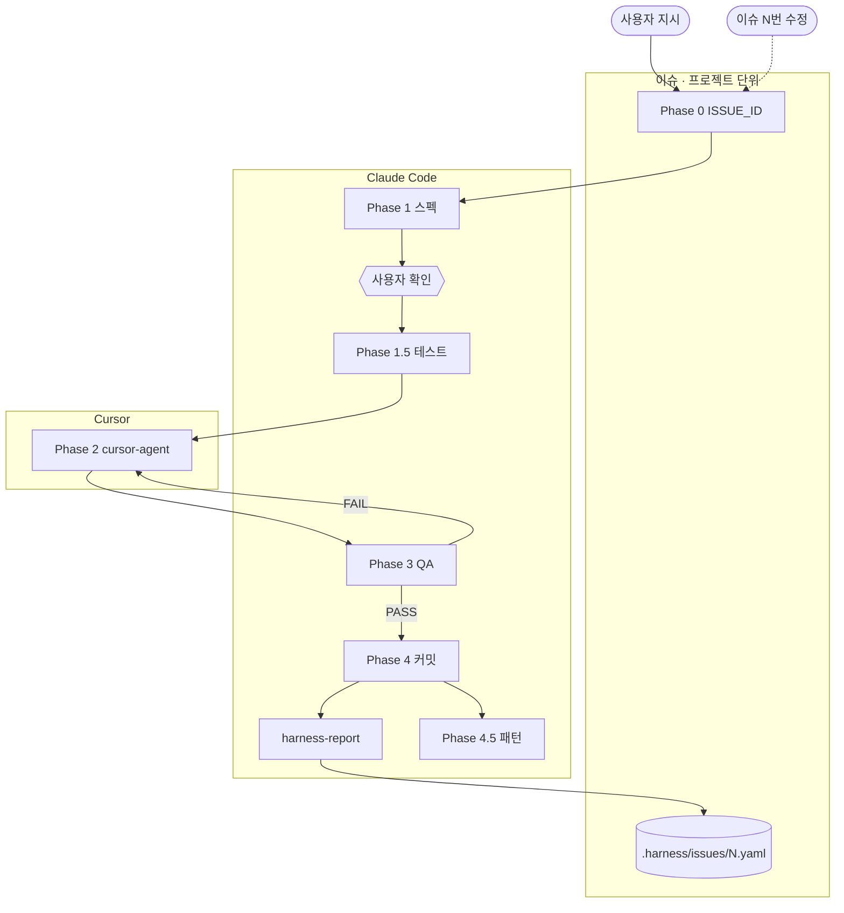

# harness_build

모든 스택 프로젝트를 위한 **Claude Code** 하네스.  
자연어 한 줄로 **기획 → 테스트 → 구현 → QA → 커밋 → (선택) 패턴**까지 실행한다.

지원 스택: **Next.js · React · Vue · Nuxt · Express · NestJS · FastAPI · Django · Flask · Go · Flutter · Android · iOS · fallback**

> **AX 팀 패턴:** `저장해줘` → `local/` · `팀에 올려줘` → `team-patterns/` PR · `install.sh --sync-patterns`

**현재 버전:** `v0.6.1` (`harness_global/VERSION`)

---

## Quick Start

```bash
git clone https://github.com/LEEHEEWON123/harness_build.git
bash install.sh /path/to/your-project
bash install.sh --sync-patterns /path/to/your-project   # 팀 패턴 갱신
```

프로젝트에서: `로그인 API 만들어줘` · `이슈 1번 수정해줘`

---

## 일상 사용

| 말하면 | 동작 |
|--------|------|
| 기능 만들어줘 / 버그 고쳐줘 | `dev` 파이프라인 (신규 이슈 ID 부여) |
| **이슈 N번 수정** | 같은 기능 이슈에 amendment run 추가 |
| 스펙/테스트/구현/QA 다시 | 해당 Phase 재실행 |
| 커밋해줘 → `저장해줘` | 커밋 → `harness-report` → 패턴 저장 |
| `팀에 올려줘` / `팀 패턴 sync` | 승격 PR / sync |

---

## 파이프라인 (dev)

**시각화:** [docs/dev-pipeline.md](docs/dev-pipeline.md)



| Phase | 산출물 |
|-------|--------|
| 0 | `ISSUE_ID`, `_workspace/..._issue-N_...` |
| 1 | `01_spec.md` |
| 2 | `02_implementation.md` |
| 3 | `03_qa_report.md` |
| 4 | 커밋 → `harness-report.sh` → `.harness/issues/` |

상세·Hub 연동: [docs/dev-pipeline.md](docs/dev-pipeline.md)

---

## 기능 이슈 추적

**이슈 = 기능 단위 (고정 ID)** · **run = 파이프라인 1회**

```
.harness/issues/1.yaml     ← 기능 #1 (제목, runs[], files[])
_workspace/..._issue-1_*/  ← 실행 이력 (initial / amendment)
```

| 항목 | 설명 |
|------|------|
| `issue_id` | `01_spec.md` frontmatter — Hub·report 기준 |
| `parent_run_id` | 수정 run이 어떤 run에서 이어지는지 |
| `harness-report.sh` | run·변경 파일 → `.harness/issues/{id}.yaml` sync |

```bash
bash .harness/scripts/harness-report.sh
```

Hub **이슈 탭**: `#1` 선택 → run 타임라인 + 누적 파일 + Phase 태스크

---

## 설치

| 명령 | 용도 |
|------|------|
| `bash install.sh /project` | 하네스 설치 |
| `bash install.sh --sync-patterns .` | 팀 패턴 sync |

산출물: `.claude/`, `harness.config.yaml`, `.harness/{patterns,issues,scripts}/`, `.cursor/rules/`

---

## harness.config.yaml

```yaml
stack: auto
phase2: cursor-agent   # cursor-agent | claude
```

전체: `harness_global/harness.config.yaml`

---

## Harness Hub

```bash
cd apps/harness-hub && cp .env.local.example .env.local
npm install && npm run dev   # :3001
```

`HARNESS_PROJECTS` 또는 `PROJECTS_ROOT` 설정.

**1차** 프로젝트 선택 → **2차 탭:** 이슈 · 패턴 · 기획 · 화면

| 탭 | 데이터 |
|----|--------|
| 이슈 | `.harness/issues/*.yaml` + `_workspace` Phase |
| 패턴 | `.harness/patterns/{team,local}` |
| 기획 | `prd.md`, `01_spec.md` |
| 화면 | `02_implementation.md` |

스택: Next.js 15 · React 19 · Tailwind v4 · TS

---

## 레포 구조

```
harness_build/
├── install.sh
├── scripts/          harness-report, run-phase2-cursor, sync-team-patterns
├── team-patterns/
├── apps/harness-hub/
└── harness_global/
```

---

## 변경 이력

| 버전 | 주요 변경 |
|------|----------|
| v0.6.0 | cursor-agent Phase 2, Harness Hub |
| v0.6.1 | 기능 이슈 추적 (`.harness/issues/`, Hub 이슈 탭) |
