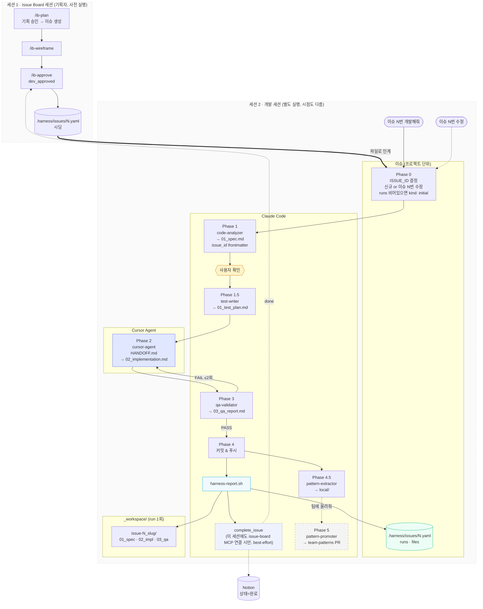
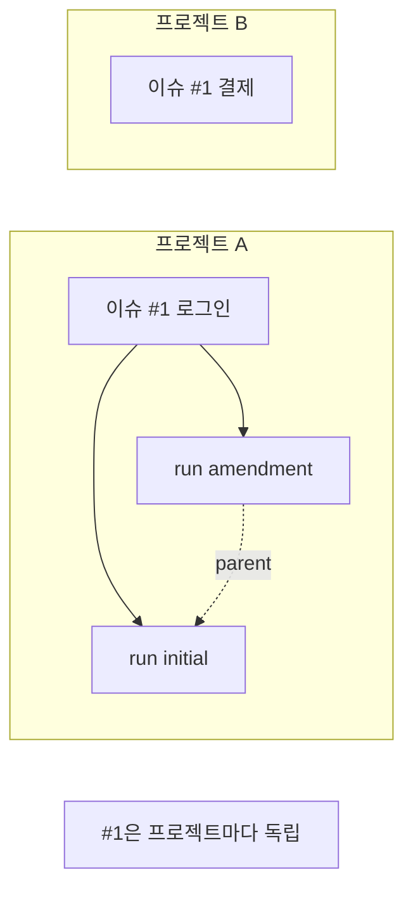
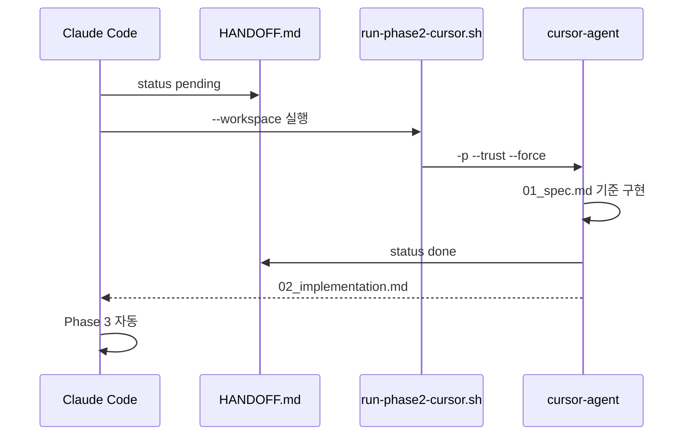
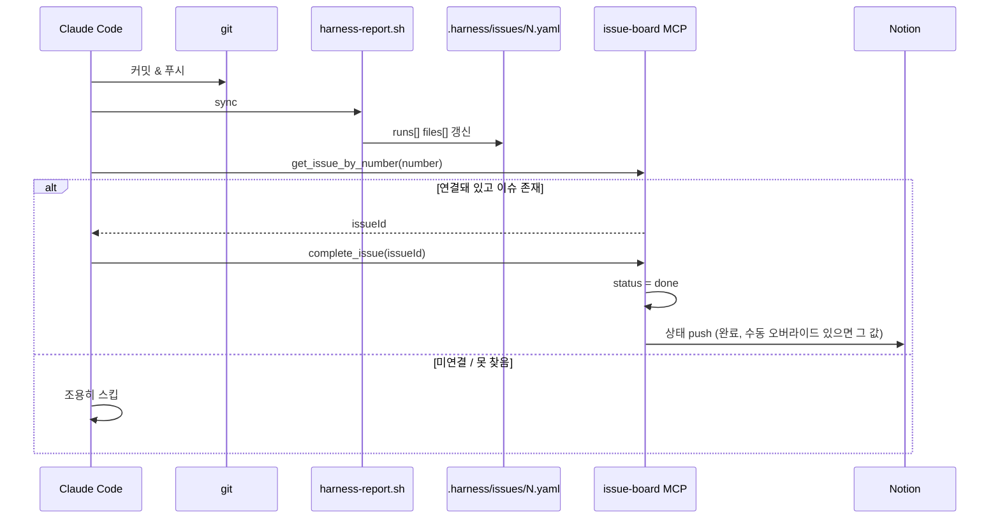
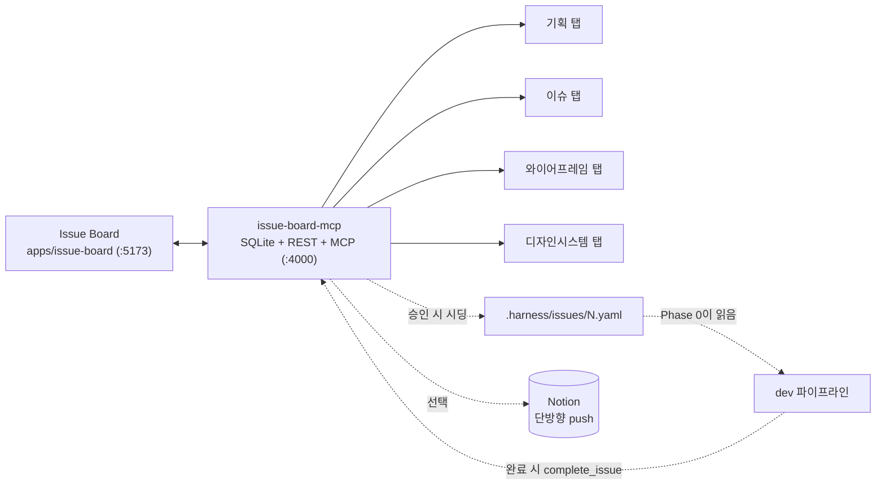

# dev 파이프라인

harness_build `dev` 스킬 Phase 흐름 (**v0.9.0**, Issue Board 연동 반영)

---

## 전체 흐름

**세션 1(Issue Board)과 세션 2(개발)는 서로 다른 Claude Code 실행**이다 — 기획은 미리, 개발은 나중에, 종종 다른 사람이 다른 cwd에서 시작한다. 둘을 잇는 통로는 두 개뿐:

1. **`.harness/issues/N.yaml` 파일** (세션 1 → 세션 2, 필수) — Phase 0이 이 파일의 `runs: []` 여부로 최초 실행 여부를 판단
2. **`complete_issue` MCP 호출** (세션 2 → 세션 1/Notion, 선택) — 세션 2 쪽 프로젝트에도 issue-board MCP(`.mcp.json`)가 연결돼 있어야 동작. 안 되어 있으면 이 단계만 조용히 스킵되고 커밋·패턴 저장은 그대로 끝난다.

---

## 이슈 vs run

| 개념 | 단위 | 저장 |
|------|------|------|
| **이슈** | 기능 (고정 ID) | `.harness/issues/N.yaml` |
| **run** | 파이프라인 1회 | `_workspace/{date}_issue-N_slug/` |
| **amendment** | 이슈 N 수정 | `parent_run_id` + 새 run |

---

## Phase 2 — cursor-agent

---

## Phase 4 — 이슈 sync + 완료 훅

---

## Phase 요약

| Phase | 에이전트 | 도구 | 산출물 |
|-------|----------|------|--------|
| 0 | — | Claude | `ISSUE_ID`, `WORKSPACE_DIR` |
| 1 | code-analyzer | Claude | `01_spec.md` + `issue_id` |
| 1.5 | test-writer | Claude | `01_test_plan.md` |
| 2 | cursor-agent | **Cursor** | `02_implementation.md` |
| 3 | qa-validator | Claude | `03_qa_report.md` |
| 4 | — | Claude | 커밋 |
| 4+ | harness-report | shell | `.harness/issues/N.yaml` |
| 4+ | complete_issue (연결 시만) | issue-board MCP | 이슈 `done` + Notion `완료` |
| 4.5 | pattern-extractor | Claude | `local/*.yaml` |
| 5 | pattern-promoter | Claude | team-patterns PR |

---

## Issue Board 연동

Harness Hub는 폐기되고 **Issue Board**(`apps/issue-board` 대시보드 + `apps/issue-board-mcp` 백엔드, SQLite)로 대체됐다.

- 승인 이후(dev_approved) 실제 개발은 `.harness/issues/N.yaml` 파일 기반이라 **issue-board 서버가 꺼져 있어도 진행 가능** — 완료 훅(`complete_issue`)만 best-effort로 실패한다.
- Notion 연동은 issue-board-mcp에서 선택 사항(`NOTION_API_KEY`/`NOTION_DATABASE_ID` 없으면 스킵)이며, 자세한 매핑은 [README.md의 Notion 동기화 절](../README.md#notion-동기화-선택) 참고.
