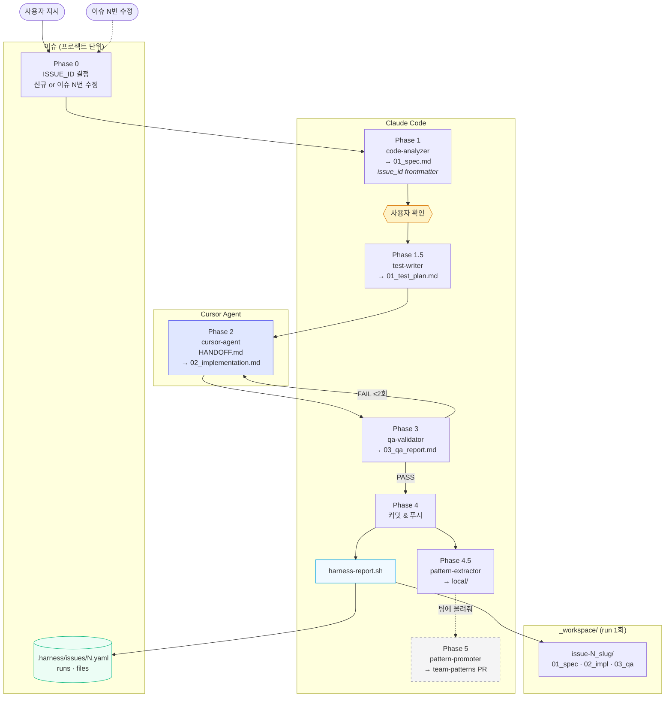
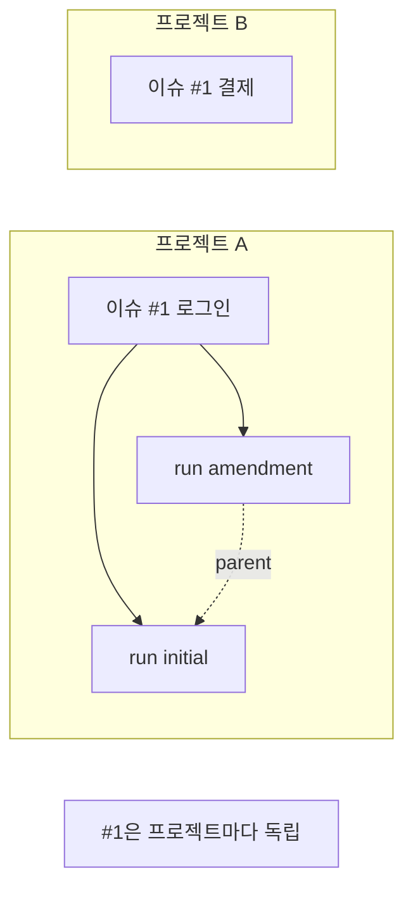
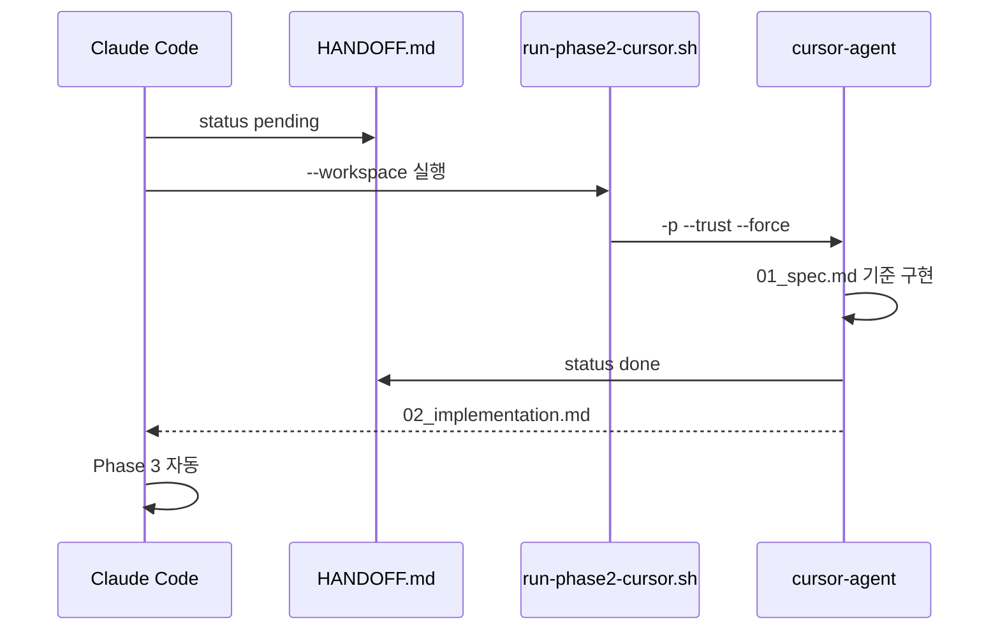
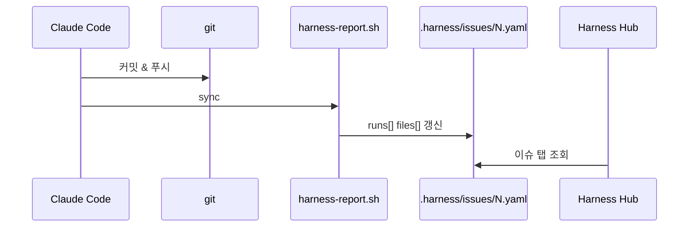
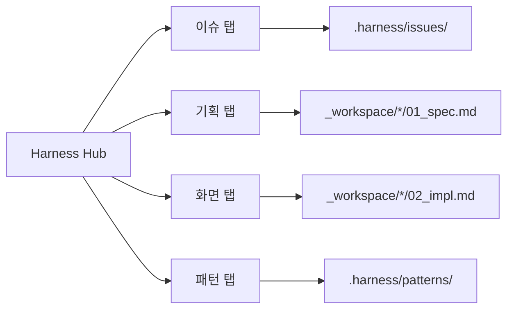

# dev 파이프라인

harness_build `dev` 스킬 Phase 흐름 (**v0.6.1**)

---

## 전체 흐름

---

## 이슈 vs run

| 개념 | 단위 | 저장 |
|------|------|------|
| **이슈** | 기능 (고정 ID) | `.harness/issues/N.yaml` |
| **run** | 파이프라인 1회 | `_workspace/{date}_issue-N_slug/` |
| **amendment** | 이슈 N 수정 | `parent_run_id` + 새 run |

---

## Phase 2 — cursor-agent

---

## Phase 4 — 이슈 sync

---

## Phase 요약

| Phase | 에이전트 | 도구 | 산출물 |
|-------|----------|------|--------|
| 0 | — | Claude | `ISSUE_ID`, `WORKSPACE_DIR` |
| 1 | code-analyzer | Claude | `01_spec.md` + `issue_id` |
| 1.5 | test-writer | Claude | `01_test_plan.md` |
| 2 | cursor-agent | **Cursor** | `02_implementation.md` |
| 3 | qa-validator | Claude | `03_qa_report.md` |
| 4 | — | Claude | 커밋 |
| 4+ | harness-report | shell | `.harness/issues/N.yaml` |
| 4.5 | pattern-extractor | Claude | `local/*.yaml` |
| 5 | pattern-promoter | Claude | team-patterns PR |

---

## Hub 연동

