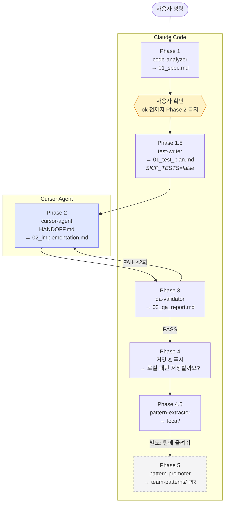
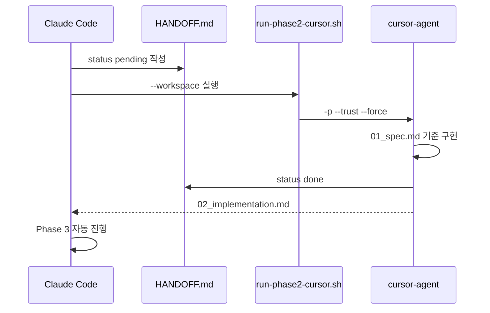

# dev 파이프라인

harness_build `dev` 스킬 Phase 흐름 (v0.6.0).

## 전체 흐름

## Phase 요약

| Phase | 에이전트 | 도구 | 산출물 |
|-------|----------|------|--------|
| 1 | code-analyzer | Claude | `01_spec.md` |
| 1.5 | test-writer | Claude | `01_test_plan.md` |
| 2 | cursor-agent | **Cursor** | `02_implementation.md` |
| 3 | qa-validator | Claude | `03_qa_report.md` |
| 4 | — | Claude | 커밋 |
| 4.5 | pattern-extractor | Claude | `local/*.yaml` |
| 5 | pattern-promoter | Claude | team-patterns PR |

## Phase 2 상세

